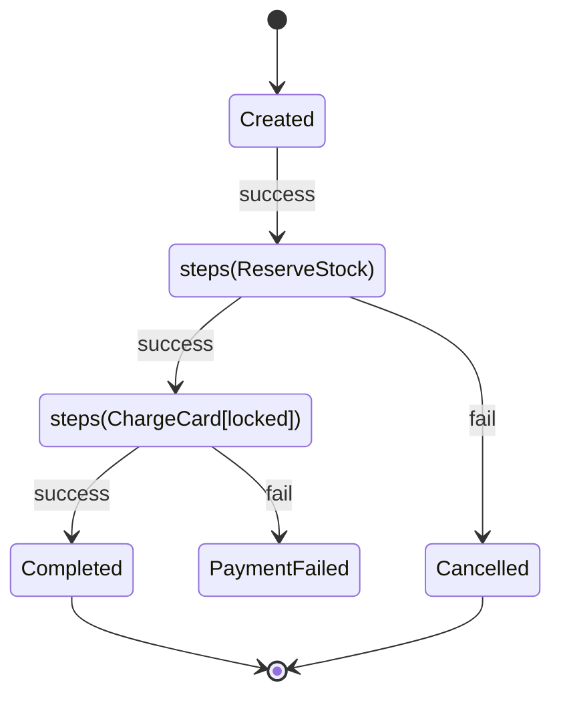

# CheckoutService

_Auto-generated from `example.stc` by the STC compiler._

```mermaid
stateDiagram-v2
    Reserved : steps(ReserveStock)
    Processing : steps(ChargeCard[locked])

    [*] --> Created
    Created --> Reserved : success
    Reserved --> Processing : success
    Reserved --> Cancelled : fail
    Processing --> Completed : success
    Processing --> PaymentFailed : fail
    Completed --> [*]
    Cancelled --> [*]
```
